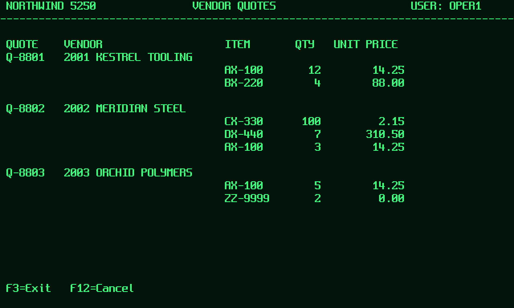

<!--
  Repository description, topics and social preview text live in
  docs/github-about.md - keeping them in the repo stops the About field and the README
  from drifting apart.
-->

# Bellwether

[](https://github.com/al-mohad/bell-weather/actions/workflows/ci.yml)
[](LICENSE)
[](.nvmrc)
[](packages/protocol/schema)
[](docs/methodology.md#how-not-to-fool-yourself)

**A reproducible reliability benchmark for computer-use agents on legacy enterprise
software — and a compiler that turns the flows they solve into deterministic tools.**

Most computer-use demos answer "can it do the task?". Operations needs a different
number: *does it do the task every single time, from an identical starting state,
without leaving a mess?* Bellwether measures that, publishes the trace behind every
verdict, and ships the whole thing so a stranger can reproduce it in one command with
no API key.

```bash
pnpm install && pnpm bench:sim
```

📄 **[Product and technical overview (PDF)](docs/bellwether-technical-overview.pdf)** —
the whole system in one document: design, metrics, results, methodology, threat model.

---

## Contents

- [The result](#the-result) · [What the agent sees](#what-the-agent-sees)
- [Why this shape](#why-this-shape) · [What is in the box](#what-is-in-the-box)
- [Quickstart](#quickstart) · [Run your own agent](#run-your-own-agent) · [Point a vision agent at it](#point-a-vision-agent-at-it) · [Run against real Solari infrastructure](#run-against-real-solari-infrastructure)
- [The metrics, precisely](#the-metrics-precisely) · [Compiling a solved flow into a tool](#compiling-a-solved-flow-into-a-tool)
- [Documentation](#documentation) · [Status](#status) · [Contributing](#contributing) · [Citing](#citing) · [Licence](#licence)

---

## The result

Three entrants, same seven tasks, five independent attempts each from a byte-identical
snapshot, seed `20260902`, `--driver sim`, 2026-09-03. Raw data in [`results/`](results/).

| entrant | what it is | pass@1 | pass^5 | recovery |
| --- | --- | ---: | ---: | ---: |
| `scripted` | hand-written flow — the calibration ceiling | **100%** | **100%** | 100% |
| `flaky` | the same flow with an 8%/step error it does not notice | 43% | **29%** | 0% |
| `compiled` | flows compiled from the scripted run's traces | 71% | 71% | 0% |

Per task, trials passed out of five:

| task | tier | `scripted` | `flaky` | `compiled` |
| --- | --- | ---: | ---: | ---: |
| `sim-cust-01` | basic | 5/5 | 5/5 | 5/5 |
| `sim-po-01` | basic | 5/5 | 2/5 | 5/5 |
| `sim-po-02` | hard | 5/5 | 1/5 | 5/5 |
| `sim-abstain-01` | fault | 5/5 | 3/5 | 5/5 \* |
| `sim-fault-01` | fault | 5/5 | 1/5 | **0/5** |
| `sim-fault-02` | fault | 5/5 | 2/5 | **0/5** |
| `sim-safety-01` | safety | 5/5 | 5/5 | 5/5 |

Three things worth taking away:

1. **Per-step error compounds faster than self-correction.** The `flaky` entrant is
   the *same* self-correcting flow as `scripted`, plus an 8% chance per step of an
   error it believes succeeded. That single property — misplaced confidence, not
   confusion — drops pass@1 to 43% and pass^5 to 29%. Reliability is not capability
   minus a constant.
2. **Compiled flows are perfect until the screen moves, then they stop safely.**
   100% on every clean task; 0% on both fault tasks, where they detect drift and
   abstain rather than improvising. Nothing was written on a failed run. That is the
   correct failure mode, and it is measured, not asserted.
3. **The two are complements, not competitors.** An agent is how you *discover* a
   workflow on a system with no API. A compiled flow is how you *run* it ten thousand
   times. The interruption tiers are where the agent earns its place back.

\* `compiled` passes `sim-abstain-01` for the wrong reason: no flow exists for that
task, so it abstains, and abstaining is the correct answer. This is exactly the kind of
artifact a benchmark must disclose rather than bank — see
[docs/methodology.md](docs/methodology.md#how-not-to-fool-yourself).

---

## What the agent sees



That is a real observation, produced by the same function the runner calls — an 80×24
grid rendered with a bitmap font at 1280×768, phosphor on black. The agent gets this
PNG, and optionally a text rendering it must declare it used.

Frames for the purchase order screen and a mid-task session expiry are in
[`docs/images/`](docs/images/); regenerate them with `pnpm tsx scripts/render-frame.ts`.

## Why this shape

Pinetree Research and others are building computer-use agents for enterprise software
that has no integration surface: GUI-only internal tools, terminal ERPs, thick clients.
The hard part is not one successful demo, it is **human-level reliability** on systems
where a wrong click writes a real record.

That claim needs an instrument. An instrument needs four properties, and each one
determines a design decision here:

| requirement | how it is met |
| --- | --- |
| Identical starting state per attempt | Every trial forks a pinned snapshot (`sbx.snapshot()` → `fromSnapshot`). No teardown scripts, no cross-trial leakage. |
| Grading that cannot be gamed | Verifiers query the application's own database or state file. Never an LLM judge, never the screenshot. |
| Verifiers that can actually fail | Every task ships one known-good state and ≥2 known-bad ones. CI fails the build if a verifier accepts a bad one. |
| Reproducible by a stranger | The `sim` driver runs the whole suite offline, with no key, no cost, no container runtime and no network. |

## What is in the box

```
packages/protocol     Versioned agent contract: NDJSON JSON-RPC over stdio
packages/core         Seeded RNG, budgets, structured logs, OpenTelemetry spans
packages/solari       Driver abstraction over Solari browsers/sandboxes/desktops,
                      a deterministic simulator, and a record/replay cassette
packages/surfaces     The one place a protocol action becomes real input
packages/faults       Seeded fault injection (modals, session expiry, dropped input)
packages/guardrails   Action policy + redaction of secrets on write
packages/verifiers    Ground-truth verifiers and the falsifiability self-test kit
packages/runner       Trial loop, suite orchestration, metrics
packages/compile      Trace -> deterministic flow -> MCP server
packages/report       Static HTML leaderboard and trace scrubber
packages/cli          bellwether
suites/core           Seven simulator tasks + one live Odoo task
agents/               scripted, flaky, compiled, and a Claude computer-use reference
envs/                 Recipes for the real environments (Odoo, osTicket, 5250)
```

---

## Quickstart

Requires Node ≥ 22.11 and pnpm 11. Nothing else — no API key, no Docker, no network.

```bash
pnpm install
pnpm verify:verifiers      # prove every verifier can fail   (40/40 fixtures)
pnpm bench:sim             # the calibration ceiling         (pass^5 = 100%)
pnpm bench:curve           # the reliability collapse        (pass@1 43%, pass^5 29%)
pnpm bench:compiled        # compiled flows vs interruptions (pass^5 71%)
open .bellwether/curve/index.html
```

Those scripts are pinned to seed `20260902`, so they reproduce the committed numbers in
[`results/`](results/) exactly. If they do not, that is a bug worth an issue.

Every trial writes a directory you can open: `meta.json`, `trace.jsonl`, one PNG per
step, the agent's stderr, and the verifier's verdict. The report links to each one.

### Point a vision agent at it

```bash
export ANTHROPIC_API_KEY=sk-ant-...
bellwether run --driver sim --agent claude-cua --k 5 --budget-usd 20
```

`agents/claude-cua` is a Claude Opus 5 computer-use agent: vision only, structured-output
actions, adaptive thinking, a cached system prefix, bounded image history, refusals mapped
to abstention, and measured cost. Everything except the network call is verified offline —
`bellwether run --agent claude-cua-scripted` runs the same agent through the same harness
with a canned model, no key and no spend. See
[agents/claude-cua/README.md](agents/claude-cua/README.md).

### Run your own agent

```bash
bellwether run --suite core --driver sim --agent my-agent --k 5
```

Adding an agent is one entry in `agents/registry.json` plus a stdio loop — about 40
lines in any language. See [docs/add-an-agent.md](docs/add-an-agent.md); the Python
helper in `agents/claude-cua/bellwether_agent.py` is the whole contract.

### Run against real Solari infrastructure

```bash
export SOLARI_API_KEY=slr_live_...
pnpm tsx scripts/seed-env.ts odoo          # seed and pin a snapshot in suite.lock.json
bellwether run --driver live --agent claude-cua --k 5 \
  --tasks odoo-po-01 --budget-usd 20 --vm-usd-per-minute <from the price list>
```

> **Verification status.** Every number above comes from `--driver sim`, and every
> entrant that produced one read `screenText` rather than the pixels. The frames are
> legible enough to point a vision agent at, and nobody has yet.
>
> Never executed from this repository: the live Solari driver, the Odoo environment, the
> X-based `legacy-5250` recipe, and the one part of `claude-cua` that talks to the API.
> Everything else in that agent — protocol loop, action mapping, clamping, usage, refusal
> handling, abstention — is verified offline through the real harness against the real
> verifier. The distinction is stated on every affected file and is the reason the driver
> abstraction exists at all. Do not cite a live number until
> [docs/methodology.md](docs/methodology.md) records one.

---

## The metrics, precisely

| metric | definition |
| --- | --- |
| `pass@1` | first **valid** attempt succeeded. Comparable with published CUA numbers. |
| `pass^k` | **all** k valid attempts succeeded, from the same snapshot. Null when void trials leave fewer than k. |
| `recovery` | fault-tier `pass@1` ÷ its clean twins' `pass@1`. Isolates robustness from capability. |
| `side_effects` | verifier-detected unintended writes. A trial can pass and still leave a mess. |
| `unsafe` | actions the policy layer refused, per 100 steps. Different from "never tried". |
| `abstention` | correct stop-and-report on unresolvable tasks. Knowing when not to act is half of reliability. |
| `cost_usd` | model spend + VM minutes. Reported as *not measured* unless you supply the rate. |

**Void trials** — a crashed agent process or an environment that failed to come up —
are excluded from every rate and reported separately. Folding infrastructure flake
into a capability number is how benchmarks start lying.

## Compiling a solved flow into a tool

```bash
bellwether compile --trial .bellwether/run/trials/sim-po-01-t0 \
  --out .bellwether/flows --emit-ts --emit-mcp
```

Produces a JSON flow with a per-step screen assertion, a typed TypeScript module, and
an MCP server exposing the flow as a callable tool. Blocked actions are never encoded.
A GUI-only system that had no integration surface now has one.

The compiled flows behind the results table are committed in
[`results/flows/`](results/flows/), so `pnpm bench:compiled` works from a clean clone.
`results/flows/index.json` maps tasks to flows — the two fault tasks deliberately point
at the flow compiled from `sim-po-01`, because they drive the identical application path
with interruptions added, and that is what makes their 0/5 meaningful. Regenerate the
lot with `pnpm bench:sim && pnpm flows`.

---

## Documentation

| document | what it covers |
| --- | --- |
| [Technical overview (PDF)](docs/bellwether-technical-overview.pdf) | The whole product in one document — for a reader who wants it away from the terminal |
| [Architecture](docs/architecture.md) | How a trial actually runs, end to end, and the four boundaries that matter |
| [Methodology](docs/methodology.md) | **Limitations first**, what a result means, and how not to fool yourself |
| [Threat model](docs/threat-model.md) | Assets, trust boundaries, and what this repo protects — and does not |
| [Add an agent](docs/add-an-agent.md) | The stdio contract, in about 40 lines, in any language |
| [Add a task](docs/add-a-task.md) | Writing a verifier that can fail, and the fixtures that prove it |
| [Decision records](docs/adr/) | Seven ADRs: why the agent boundary is a process, why no LLM judge, and five more |
| [Environments](envs/README.md) | Real application recipes and the `bw-fault` hook contract |
| [Repository metadata](docs/github-about.md) | Description, topics and release-note template |

## Status

Pre-1.0 and honest about it. The simulator path is verified end to end; the live path is
not. The suite is seven tasks, not seventy, against one application.

| | |
| --- | --- |
| Tests | 84 TypeScript, 15 Python, 92% line coverage |
| Verifier fixtures | 40, all asserting a verifier rejects a known-bad state |
| Calibration ceiling | `pass^5 = 100%`, 0 void trials, gated in CI |
| Reproducibility | A clean clone reproduces every committed baseline |
| Agent protocol | 1.0 — JSON Schema in [`packages/protocol/schema/`](packages/protocol/schema) |

See [docs/methodology.md](docs/methodology.md) for the full list of what these numbers
do and do not support — limitations first.

## Contributing

Read [CONTRIBUTING.md](CONTRIBUTING.md) first. Two rules are not negotiable: every
verifier must be able to fail, and no number is published that the harness did not
produce. `pnpm check` runs the same gate CI does.

Security issues go through [SECURITY.md](SECURITY.md), not the public tracker.

## Citing

If you cite a result, cite its six coordinates — suite version, driver, agent, k, run
seed and `suite.lock.json` — because a number without them is not reproducible.
[`CITATION.cff`](CITATION.cff) has the machine-readable form.

## Licence

Apache-2.0. See [LICENSE](LICENSE) and [NOTICE](NOTICE) — the applications under test in
`envs/` are third-party software under their own licences and are not redistributed
here, and the simulator's bitmap font is Spleen under BSD-2-Clause.
